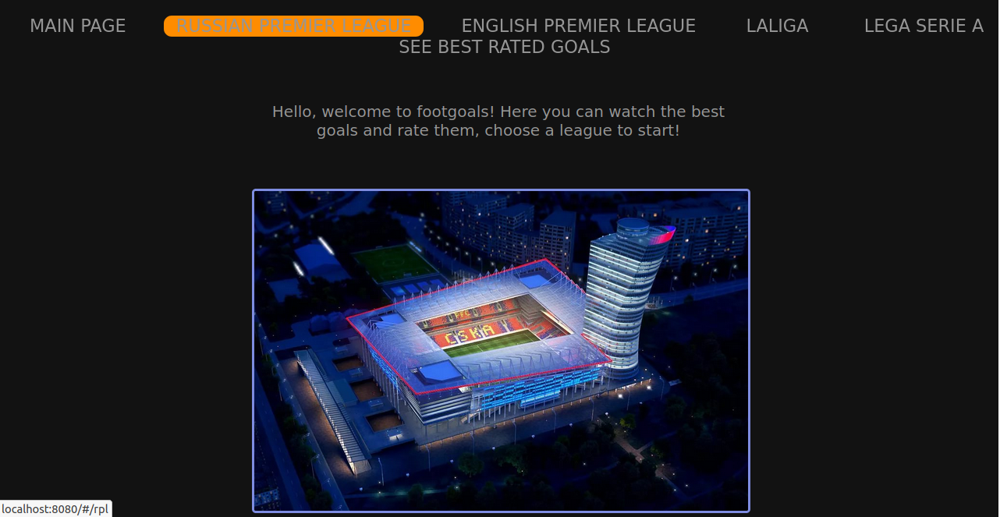

- `version 1.0.0`
  - Main page only.
- `version 1.1`
  - Added mongodb,
  - Videos,
  - Input type radio.
- `version 1.2` 
  - Rating modified, 
  - localStorage connected to limit votes.
- `version 1.3` - current. 
  - Modified classes in Rpl.js. 
  - Added function - see a best rated video
  - Minor improvements
  

